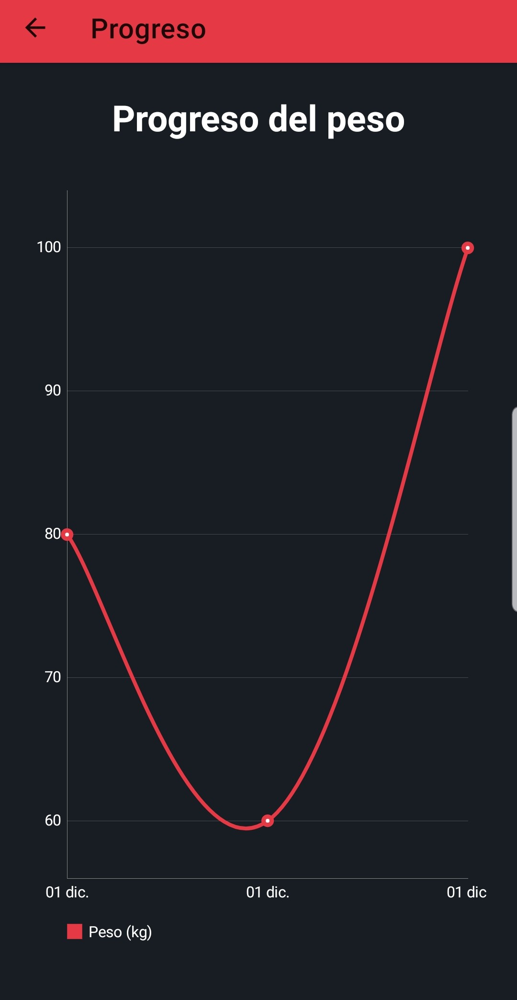
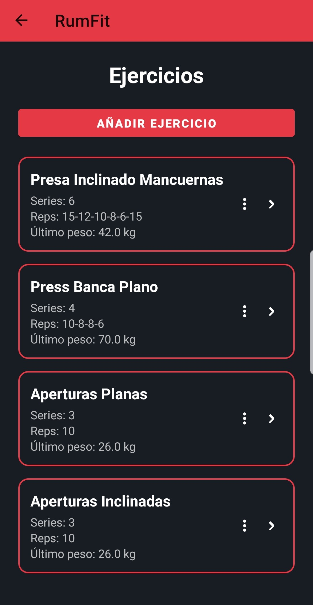

# 📱 RumFit — App Fitness para Android

**RumFit** es una aplicación móvil desarrollada en **Kotlin + MVVM** que permite gestionar rutinas de entrenamiento de forma sencilla y visual.

Actualmente es **plenamente funcional**, pero se encuentra en **desarrollo activo**, incorporando nuevas características y mejoras de forma continua.
Este proyecto forma parte de mi **Trabajo de Fin de Grado (TFG)** del Grado Superior de **Desarrollo de Aplicaciones Multiplataforma** y está siendo preparado para su **lanzamiento oficial en el mercado**.

La versión pública incluye la APK, capturas y documentación del proyecto.  
El **código fuente** se encuentra en un repositorio **privado**, disponible bajo petición para empresas o reclutadores.

---

## 🚀 Funcionalidades principales (versión actual)

- Crear **rutinas personalizadas**
- Añadir y gestionar **ejercicios**
- Revisar el **progreso del peso** mediante gráficas
- Pantalla de **perfil de usuario**
- Interfaz moderna con estilo oscuro
- Persistencia local mediante **Room Database**
- Arquitectura **MVVM** para una app organizada y escalable

> 🔧 *Nuevas funcionalidades están en desarrollo y se irán añadiendo próximamente.*

---

## 📥 Descargar APK

👉 [Descargar RumFit.apk](https://raw.githubusercontent.com/rumeenorachev/RumFit-Public/main/media/apk/RumFit.apk)  
*(Funciona en dispositivos Android 8.0 o superior)*

---

## 📸 Capturas de la aplicación

| Progreso del peso | Ejercicios |
|------------------|------------|
|  |  |

---

## 🎨 Mockup promocional

---

## 📄 Documentación del proyecto

Incluye una presentación preliminar del proyecto RumFit, donde se muestran las funcionalidades actuales, el diseño de la app y el progreso del desarrollo.

👉 [Ver presentación (PDF)](media/documentation/RumFit_Presentacion.pdf)

---

## 🧱 Arquitectura

RumFit está construida siguiendo el patrón **Model–View–ViewModel (MVVM)** utilizando el stack moderno de Android:

- **Kotlin**
- **ViewModel**
- **LiveData**
- **Room Database**
- **Repository Pattern**
- **RecyclerView**
- **Material Design**

---

## 🔒 Código fuente

El código completo se encuentra en un repositorio **privado**.  
Si deseas revisarlo (empresas, profesores o reclutadores):

📩 **Contacta conmigo y te enviaré una invitación con acceso.**

---

## 🌐 Portfolio

Puedes ver este proyecto en mi portfolio web:

👉 https://www.rumenorachev.es

---

## 👤 Autor

**Rumen Orachev Orachev**  
Programador Full Stack 
